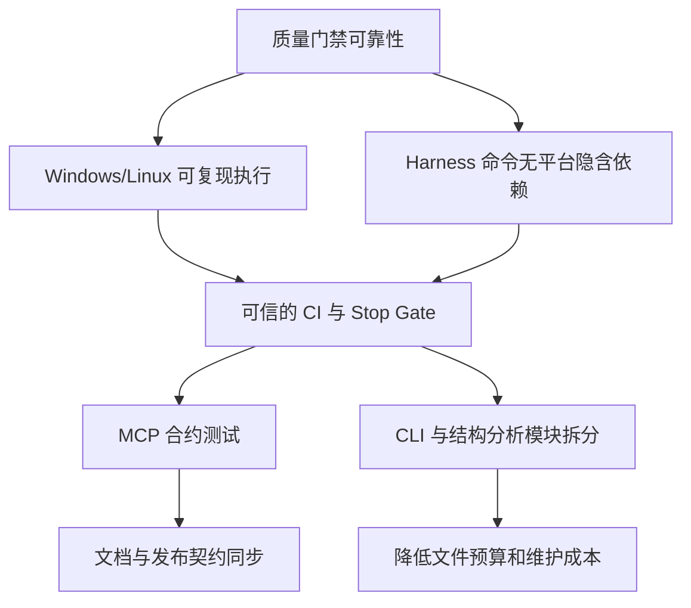

# Entrix 项目优化与补充计划

> 范围：基于 2026-08-21 当前 checkout 的代码、测试、Harness 和 CI 配置做的可执行改进建议。
> 目标：先恢复质量门禁在本地和 CI 的可信度，再补齐未覆盖的公共接口，最后降低长期维护成本。

## 当前基线

| 检查 | 结果 | 说明 |
| --- | --- | --- |
| `python -m pytest --collect-only -q` | 530 collected | 收集本身正常 |
| 全量 pytest（独立临时目录） | 526 passed, 4 skipped | 使用独立 `--basetemp` 后通过 |
| 默认 `pytest` | 257 passed, 4 skipped, 269 errors | 固定 `.pytest-sandbox` 在当前 Windows 工作区无法清理 |
| `ruff check .` | PASS | 当前静态检查通过 |
| `mypy` | PASS | 只检查配置中的 13 个 source targets |
| `python -m build --no-isolation` | PASS | sdist/wheel 均可构建 |
| `entrix harness validate harness.yaml` | PASS | 3 producers、2 gates |
| `entrix harness run --json` | FAIL | fitness hard gate 被默认 pytest 失败阻断；Windows 下 `no_new_debug_prints` 为 UNKNOWN |
| `entrix analyze long-file --config file_budgets.json --json` | PASS | 当前无超预算变更 |

语义搜索 MCP 因本机没有 `WINDSURF_API_KEY` 未能使用；以上结论来自本地源码、测试、配置和实际命令输出。

## 关键关系



## 优先级计划

### P0：修复跨平台质量门禁基线

依据：`pyproject.toml:81` 将 pytest 临时目录固定为仓库内 `.pytest-sandbox`；默认测试在当前 Windows 工作区因 `PermissionError: [WinError 5]` 大量 setup error，而替代独立临时目录后全量通过。`harness.yaml:16-23` 使用 `grep`、`wc`、`awk` POSIX 管道，Windows 本地执行直接变为 `UNKNOWN`。

实施：

- 移除固定仓库级 `--basetemp`，或改为每次运行唯一且可清理的系统临时目录；保留 `--import-mode=importlib`。
- 将 `no_new_debug_prints` 改成跨平台 Python 检查脚本/模块，统一处理 tracked、staged、untracked 与 `ENTRIX_FITNESS_BASE` 的边界。
- 将 Harness 中的 `python3 -m ...` 统一为当前解释器可调用的 `python -m ...`，或由 producer 提供平台无关的 Python executable。
- 增加 Windows CI 或至少增加本地 Windows 回归命令，验证 `pytest`、`entrix run`、`entrix harness run` 不出现 UNKNOWN/环境级失败。

验收：

```text
python -m pytest -q
python -m entrix run --tier normal --scope local --min-score 0
python -m entrix harness run --config harness.yaml --json
```

预期：测试全通过，`no_new_debug_prints` 为 PASS/明确 SKIPPED 而非 UNKNOWN，Harness 不因平台命令失败。

### P1：恢复 MCP 公共接口的可执行契约

依据：`entrix/server.py` 暴露 `run_fitness`、`get_dimension_status`、`analyze_change_impact` 三个工具；但当前仓库不存在 `tests/test_mcp_server.py`、`tests/test_mcp_tools.py`、`tests/test_mcp_error_handling.py` 和 `tests/test_mcp_return_value_schema.py`。`docs/notes/MCP_COMPLETION_SUMMARY.md` 仍声称存在 51 个测试，历史提交 `e23a0e3` 明确移除了这些文件。

实施：

- 增加轻量注册/签名/返回 schema 测试，覆盖三工具、枚举转换、JSON 可序列化和 graph 不可用时的降级。
- 增加一次真实 stdio MCP 握手/工具列表 smoke test；把 `fastmcp` 放入专用 CI job，避免普通核心测试因可选依赖缺失而失真。
- 对无 `harness.yaml`、无 graph backend、错误 tier/scope、工具执行异常定义稳定的错误结构。
- 更新或归档 MCP 完成总结，删除“已创建但不存在”的测试数量声明。

验收：

```text
python -m pytest tests/test_mcp*.py -q
python -m pytest -q
```

### P1：清理历史计划、状态和实际实现的漂移

依据：`docs/plan.md` 仍包含未勾选的旧任务，并引用当前不存在的 `entrix/stop_gate/adapter.py` 与 `tests/stop_gate/test_integration.py`；`docs/notes/TEST_STATUS.md` 仍记录“459 通过、13 个 Stop Gate 失败”和已删除 MCP 测试，与当前 530 项收集结果冲突。

实施：

- 将 `docs/plan.md` 和旧测试状态标记为历史归档，或重写成当前主线计划；不要继续保留会被误认为现状的数字。
- 在 CI 自动生成测试/门禁摘要，减少人工维护的“当前状态”文档。
- 对 `docs/design`、`docs/superpowers` 中已完成设计注明实现 commit/当前入口，删除已不存在文件的操作指引。

### P1：拆分两个长期文件热点

依据：`entrix/cli.py` 当前约 2053 行，`entrix/structure/builtin.py` 当前约 1662 行；`file_budgets.json` 和 `file_budgets.pre_commit.json` 都把它们冻结在当前基线，并写明“后续拆分计划”。这会让任何继续加功能的改动直接撞到预算边界。

实施：

- 将 CLI 按 `run`、`harness`、`graph`、`release`、`hook` 子命令拆到模块，保留一个薄的 parser/dispatch 层。
- 将结构分析按语言或职责拆分，抽取公共 AST/索引协议；先迁移 Python/TypeScript，再迁移 Go/Rust/Java。
- 每次拆分先迁移现有测试，不改变 CLI 输出和退出码；逐步收紧 file budget override。

### P2：提高质量信号的深度和可解释性

实施：

- 为核心路径增加覆盖率报告和最低阈值，至少覆盖 Harness config、producer、gate DSL、Stop Gate hook、CLI 路由；不要只统计测试数量。
- 扩大 mypy 范围。当前 `pyproject.toml:90-99` 只列出 13 个 targets，`cli.py`、`server.py`、graph/reporting 等公共入口没有进入类型门禁。
- 在 Ruff 当前 `E/F/W/I` 基础上分阶段加入 bugbear、UP、异常处理和安全相关规则，先报告后阻断。
- 将 Harness 中 `observability`/`performance` 的 weight-0 placeholder 与实际门禁区分：要么实现 `scripts/obs` 探针，要么移到示例配置并明确“未启用”，避免产生不可执行的能力承诺。

### P2：减少 CI 重复执行并明确职责

依据：`.github/workflows/ci.yml` 已执行 lint、全量 pytest、mypy、build；`.github/workflows/defense.yml` 又通过 `entrix run` 执行 Harness，其中包含同一 pytest hard gate，并额外做 review trigger。

实施：

- 让 CI workflow 负责一次完整正确性验证，Defense workflow 负责变更感知的治理、review trigger 和 step summary，避免重复跑完整测试。
- 在 workflow 中显式校验 `harness.yaml`，并把结构化报告作为 artifact；区分“代码测试失败”和“治理规则触发”。
- 对发布 workflow 保留单独的多平台构建和 checksum 验证，不把发布门禁和日常测试继续混在一起。

## 推荐实施顺序

1. P0 跨平台测试与 Harness 命令修复。
2. P1 MCP 合约测试和 CI 可选依赖 job。
3. P1 文档/计划归档与自动化状态摘要。
4. P2 CI 去重、覆盖率和类型检查扩展。
5. P1 CLI/结构分析拆分，按小批次降低文件预算。

## 暂不建议

- 不建议直接放宽 `file_budgets` 来消除大文件告警；这会掩盖既有拆分计划。
- 不建议把 MCP 测试重新塞进普通核心测试而不安装 `[mcp]`；应采用可选依赖专用 job 或明确 skip。
- 不建议现在修改用户未提交的 `.claude/settings.local.json`。

## 决策点

- 若只做一轮小改，优先批准 P0 + P1 MCP 合约测试；它们直接影响门禁可信度和公开集成可靠性。
- 若准备做持续重构，再批准 CLI/结构分析拆分，并把每次拆分限制在一个子系统内。
