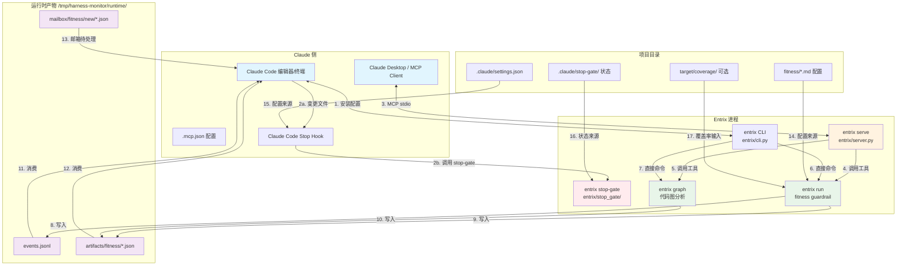
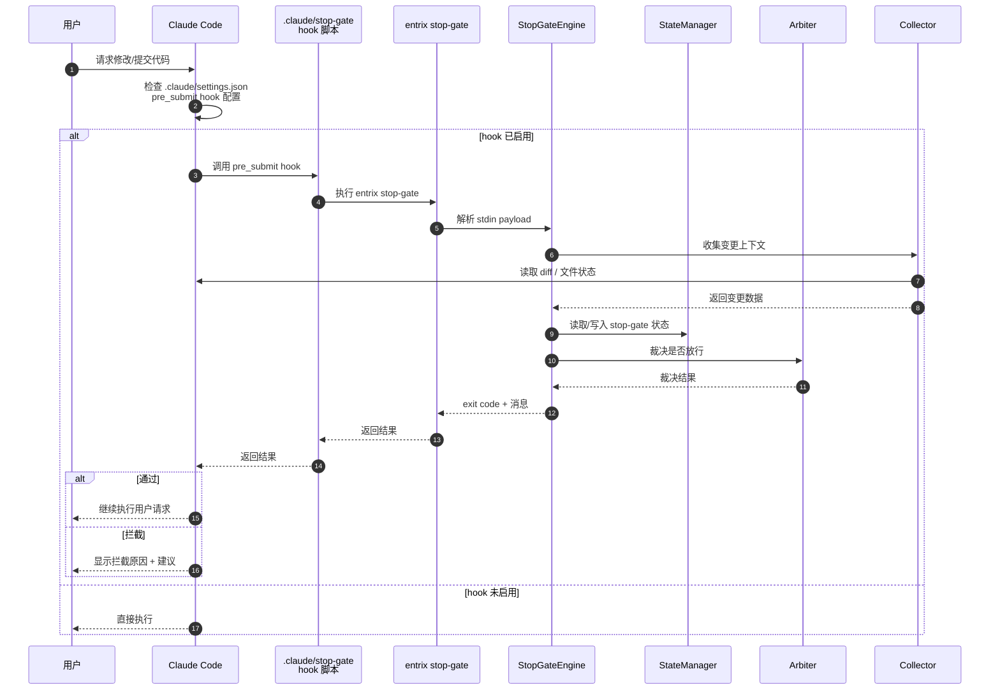
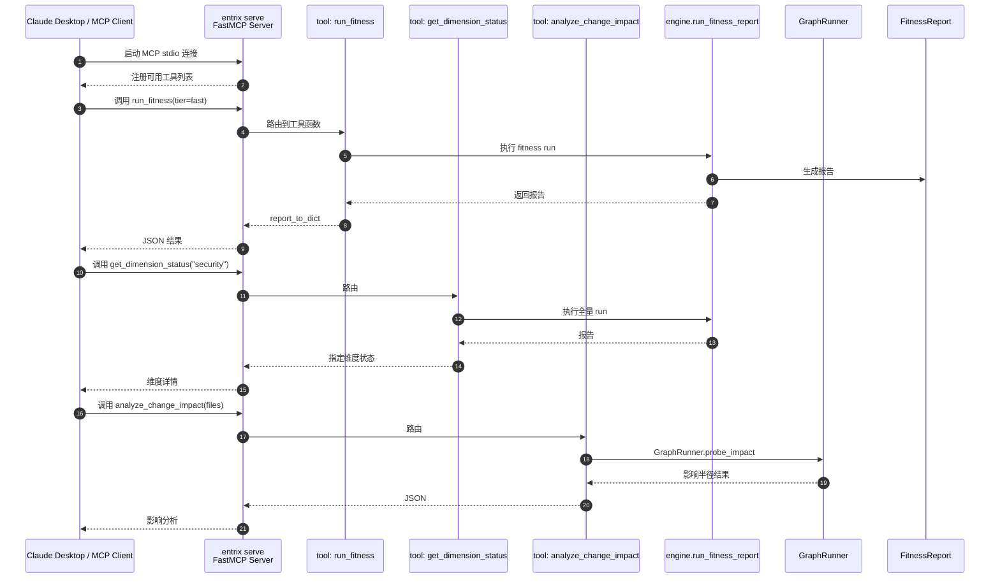
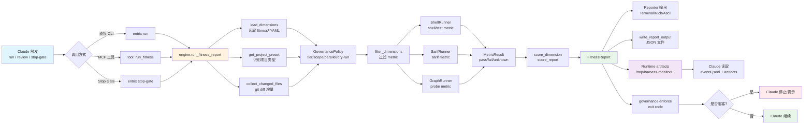
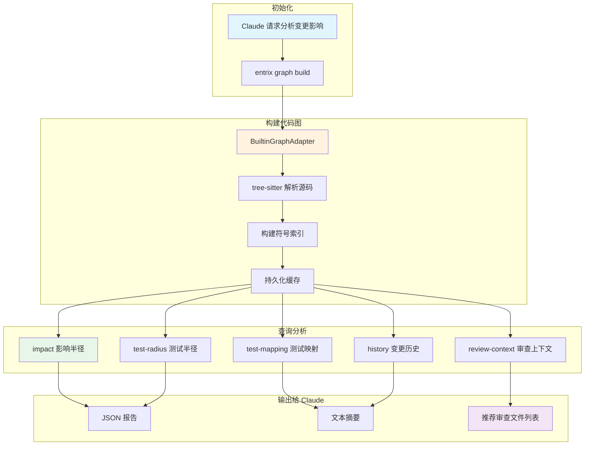
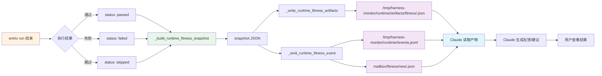
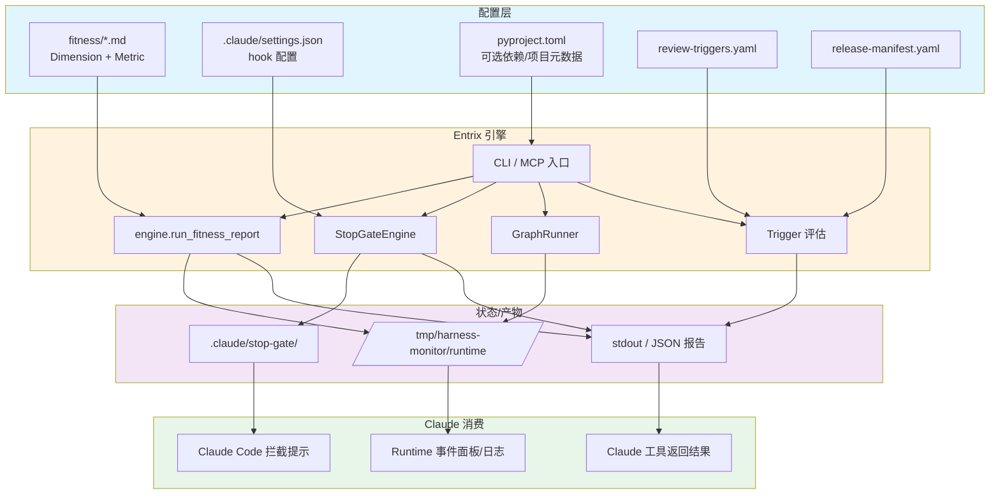

# Entrix × Claude 集成全景流程图

> 本图重点展示 Entrix 在 Claude Code / Claude Desktop 环境下的完整调用链路与数据回流路径。

## 全景总览

---

## 1. Claude Code Stop Gate 拦截流程

---

## 2. MCP Server 工具调用流程

---

## 3. `entrix run` 在 Claude 上下文中的完整执行链

---

## 4. Graph 代码图分析在 Claude 中的使用路径

---

## 5. 运行时事件与 Claude 反馈闭环

---

## 6. 配置与数据流关系图

