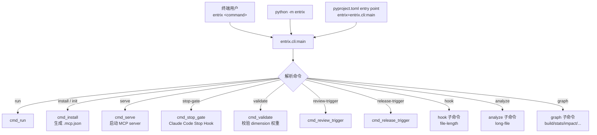
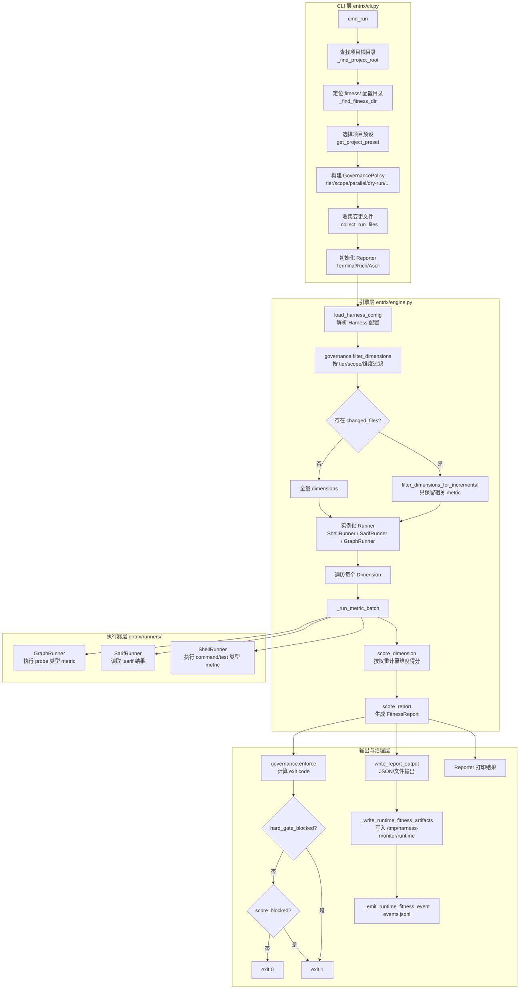
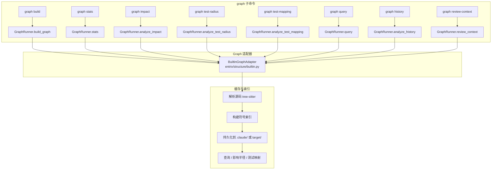
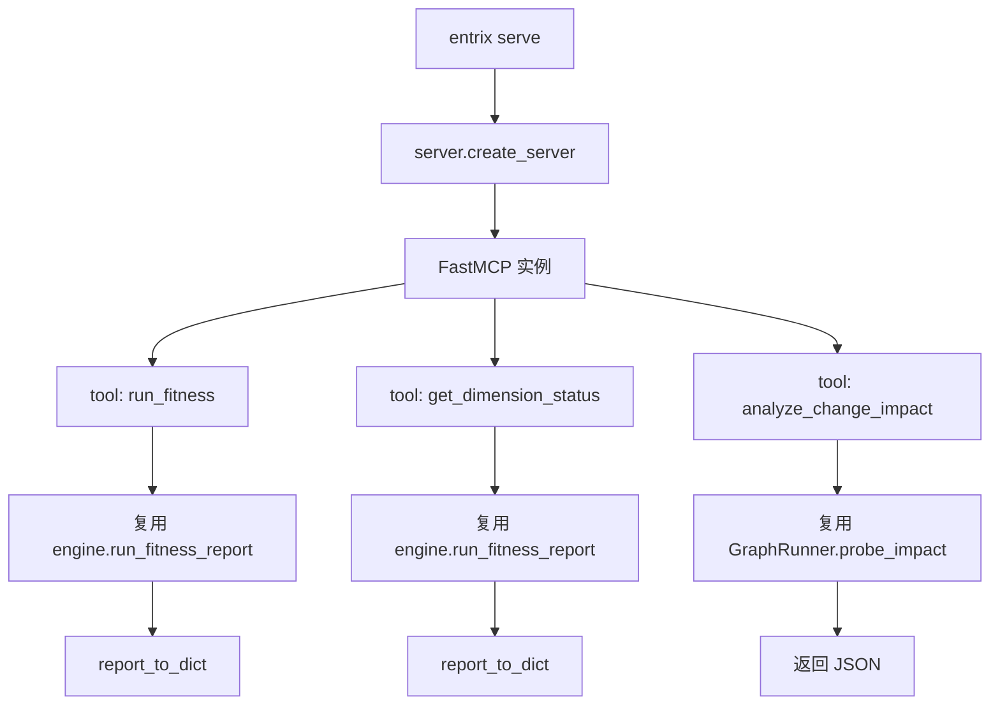
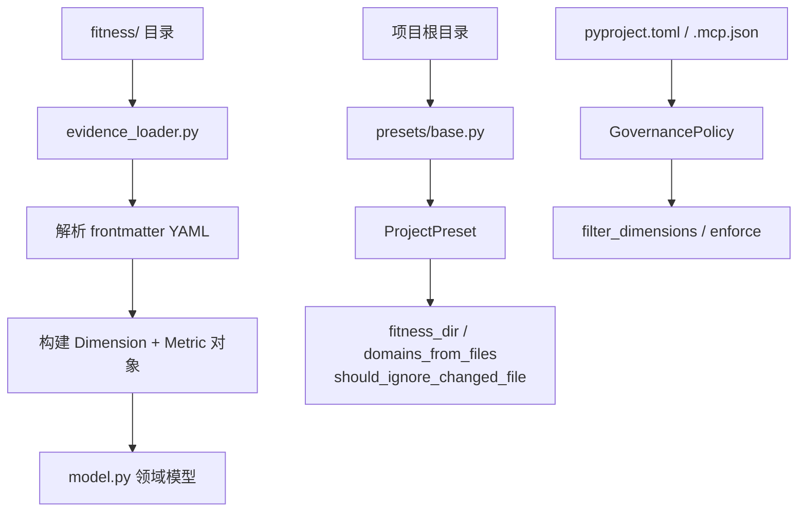
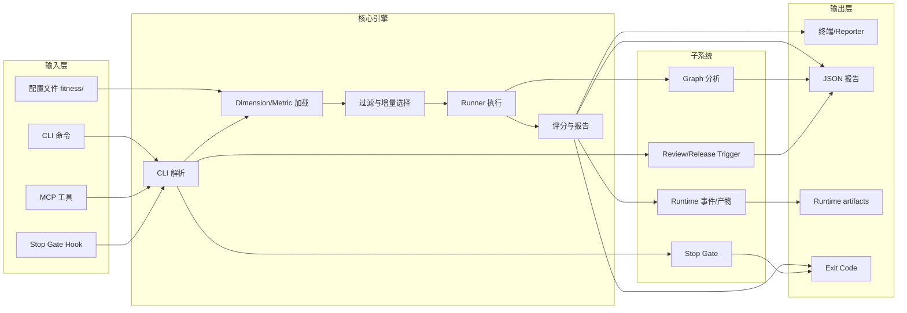

# Entrix 执行流程图

> 本文用 Mermaid 描述 `entrix` 从入口到各类子命令的完整执行路径。

## 1. 顶层入口与命令分发



## 2. 核心 `entrix run` 流程



## 3. Metric 执行细节

```mermaid
flowchart TD
    A[_run_metric_batch] --> B{evidence_type}
    B -->|COMMAND / TEST| C[ShellRunner.run_batch]
    B -->|PROBE| D[_run_probe_metric]
    B -->|SARIF| E[SarifRunner.run_batch]
    B -->|MANUAL_ATTESTATION| F[占位 UNKNOWN]

    C --> C1[并行或串行执行 shell]
    C --> C2[stream / capture 输出]
    C --> C3[匹配 pattern 判定 pass/fail]
    C1 --> C4[MetricResult]

    D --> D1{waiver 有效?}
    D1 -->|是| D2[WAIVED]
    D1 -->|否| D3{dry-run?}
    D3 -->|是| D4[DRY-RUN 占位]
    D3 -->|否| D5{probe 命令}
    D5 -->|graph:impact| E1[GraphRunner.probe_impact]
    D5 -->|graph:test-radius| E2[GraphRunner.probe_test_coverage]
    D5 -->|graph:test-mapping| E3[GraphRunner.probe_test_mapping]
    D5 -->|其他| E4[UNKNOWN 错误]

    E --> E5[读取命令指定 sarif 文件]<br/>E5 --> E6[汇总 violations] --> E7[MetricResult]
```

## 4. Graph 子系统



## 5. Trigger 与 Stop Gate 流程

```mermaid
flowchart TD
    subgraph Review["review-trigger"]
        R1[collect_changed_files] --> R2[collect_diff_stats]
        R2 --> R3[load_review_triggers]
        R3 --> R4[evaluate_review_triggers]
        R4 --> R5[输出需要人工 review 的文件/规则]
    end

    subgraph Release["release-trigger"]
        L1[load_release_manifest] --> L2[load_release_triggers]
        L2 --> L3[evaluate_release_triggers]
        L3 --> L4[输出 release 风险报告]
    end

    subgraph StopGate["stop-gate"]
        S1[Claude Code 调用<br/>stop-gate hook] --> S2[cmd_stop_gate]
        S2 --> S3[读取 stdin payload]
        S3 --> S4[StopGateEngine<br/>entrix/stop_gate/]
        S4 --> S5[Collector 收集上下文]
        S5 --> S6[Arbiter 裁决是否拦截]
        S6 --> S7{通过?}
        S7 -->|是| S8[exit 0]
        S7 -->|否| S9[exit 非0 + 拦截提示]
    end
```



## 6. MCP Server 集成



## 7. 数据与配置加载



## 8. 整体汇总图


