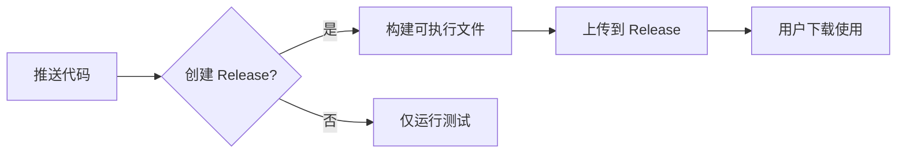

# Entrix GitHub Actions 集成指南

## 🚀 快速开始

### 1. 添加 GitHub Remote

```bash
# 添加 GitHub 远程仓库
git remote add github https://github.com/phodal/entrix.git

# 推送到 GitHub
git push github main
```

### 2. 创建 Release

在 GitHub 上创建 Release 时，会自动触发构建。

### 3. 下载可执行文件

用户从 Release 页面下载对应平台的文件。

## 📋 自动构建流程



## 🔧 本地开发流程

```bash
# 1. 开发新功能
git checkout -b feature/new-feature

# 2. 提交并推送
git add .
git commit -m "feat: 新功能"
git push github feature/new-feature

# 3. 创建 PR
# 在 GitHub 上创建 Pull Request

# 4. 合并后创建 Release
# 在 GitHub Releases 页面创建新 Release

# 5. 自动构建
# GitHub Actions 自动构建所有平台的可执行文件
```

## 📦 版本发布

### 发布前检查

- [ ] 运行本地测试
- [ ] 更新版本号 (pyproject.toml)
- [ ] 更新 CHANGELOG.md
- [ ] 确保所有测试通过

### 创建 Release

1. 在 GitHub 上进入 "Releases" 页面
2. 点击 "Draft a new release"
3. 填写版本信息：
   - Tag: `v0.1.22`
   - Title: `Entrix v0.1.22`
   - Description: 更新内容
4. 点击 "Publish release"

### 自动构建产物

Release 发布后会自动生成：

```
v0.1.22/
├── entrix-windows-amd64.zip       # Windows
├── entrix-linux-amd64.tar.gz      # Linux
├── entrix-macos-amd64.tar.gz      # macOS
├── entrix-0.1.22-py3-none-any.whl  # Python Wheel
└── entrix-0.1.22.tar.gz            # 源码包
```

## 🧪 测试

### 自动测试

每次 push 和 PR 都会自动运行测试。

### 查看测试结果

在 GitHub Actions 页面查看测试运行状态。

## 📊 状态徽章

在 README.md 中添加状态徽章：

```markdown
[]
[]
```

## 🔐 安全

### Secrets 配置

如果要发布到 PyPI，需要配置：

1. 在 GitHub 仓库设置中添加 Secret
2. Name: `PYPI_API_TOKEN`
3. Value: 你的 PyPI API token

### 权限

GitHub Actions 需要以下权限：
- `contents: write` - 创建 Release
- `packages: write` - 发布到 PyPI（可选）

## 📚 相关资源

- [GitHub Actions 文档](https://docs.github.com/en/actions)
- [PyInstaller 文档](https://pyinstaller.org/)
- [Semantic Versioning](https://semver.org/)
- [项目 README](../README.md)
