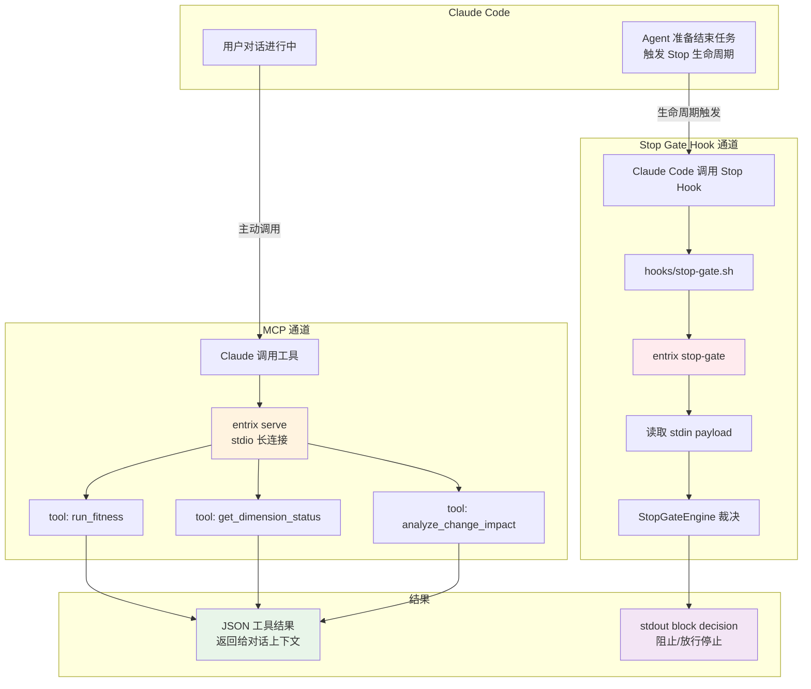
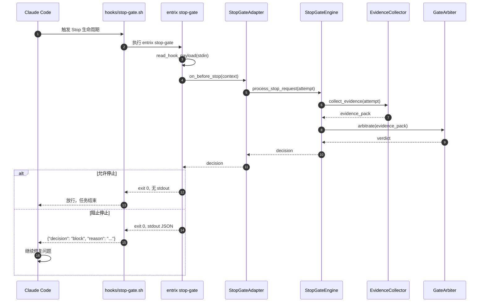

# Entrix MCP vs Stop Gate 调用关系

> 说明 `entrix serve`（MCP）和 `entrix stop-gate`（Claude Code Hook）是两套不同的集成机制。

## 调用方式对比



## Stop Gate Hook 执行细节



## 关键区别

| 特性 | MCP Server (`entrix serve`) | Stop Gate Hook (`entrix stop-gate`) |
|------|---------------------------|-----------------------------------|
| 触发时机 | 对话中 Claude 主动调用 | Claude Code 准备停止任务时自动触发 |
| 调用入口 | `plugin.json` 中 `mcpServers` | `hooks/hooks.json` 中 `Stop` hook |
| 通信方式 | stdio JSON-RPC | stdin 输入 payload，stdout 输出决策 |
| 返回值 | 工具结果 JSON | 阻断时输出 `{"decision": "block"}` |
| 是否可见 | 用户可见工具调用 | 通常不展示，只决定是否放行 |
| 配置位置 | `.mcp.json` / `plugin.json` | `.claude/settings.json` + `hooks/hooks.json` |

## Stop Gate  payload 示例

Claude Code 通过 stdin 发送给 `entrix stop-gate` 的 JSON：

```json
{
  "session_id": "uuid",
  "transcript_path": "/path/to/transcript.jsonl",
  "cwd": "/Users/apple/entrix",
  "hook_event_name": "Stop",
  "stop_hook_active": false,
  "reason": "agent_completed"
}
```

## 手动测试 Stop Gate

```bash
# 1. 确保当前仓库有 docs/fitness/ 配置
ls docs/fitness/

# 2. 模拟 Claude Code 输入
echo '{"session_id": "test", "cwd": "'"$PWD"'"}' | entrix stop-gate

# 3. 输出为空 -> 放行
#    输出 {"decision": "block", "reason": "..."} -> 阻止
```

## 禁用 Stop Gate

```bash
export ENTRIX_STOP_GATE_DISABLED=1
```

## 本地开发时让 Stop Gate 使用当前源码

```bash
# 使用当前 venv 的 entrix
source .venv/bin/activate

# 手动调用 stop-gate 查看行为
echo '{"session_id": "test", "cwd": "'"$PWD"'"}' | entrix stop-gate
```
